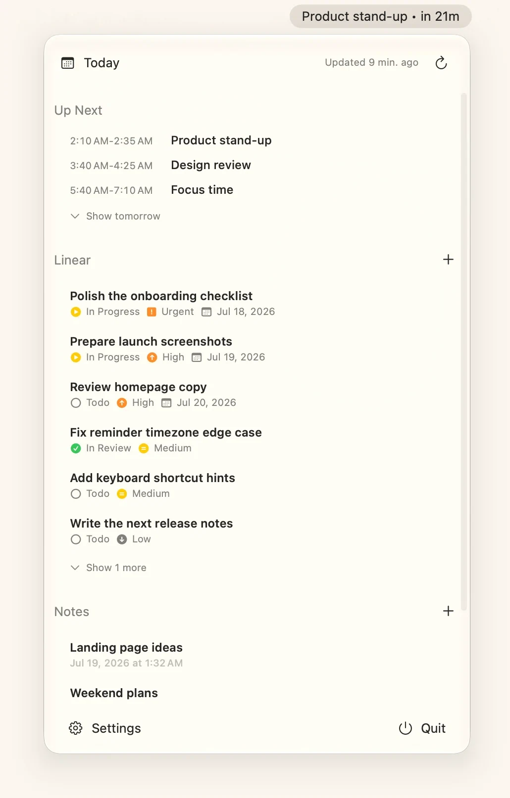
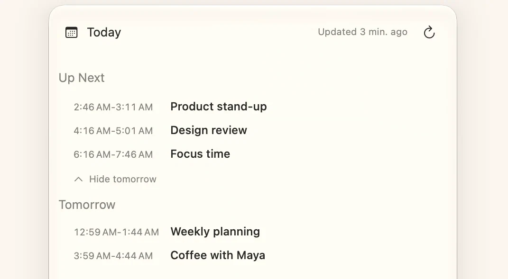
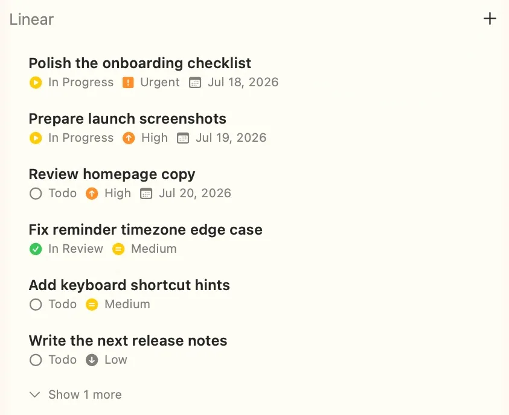
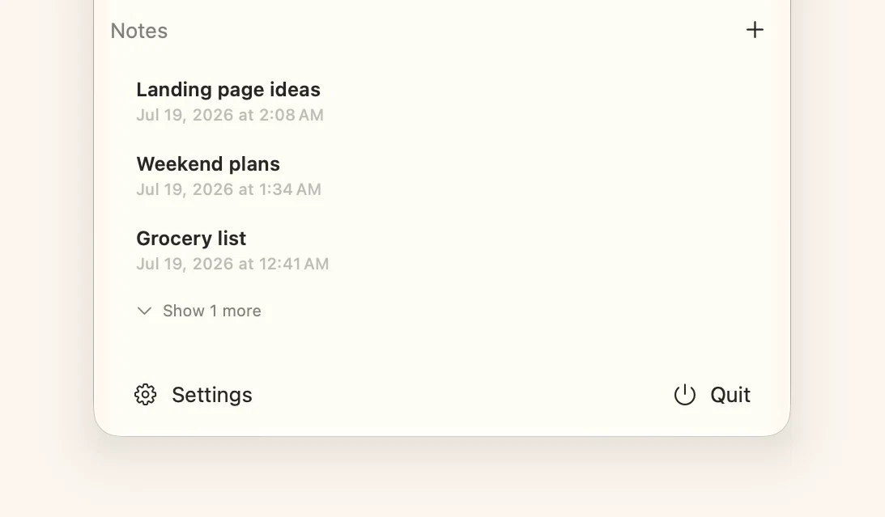
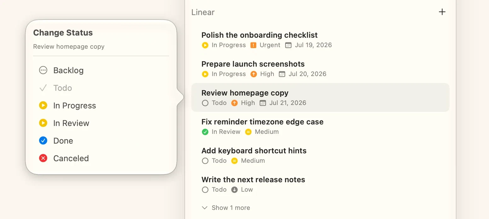
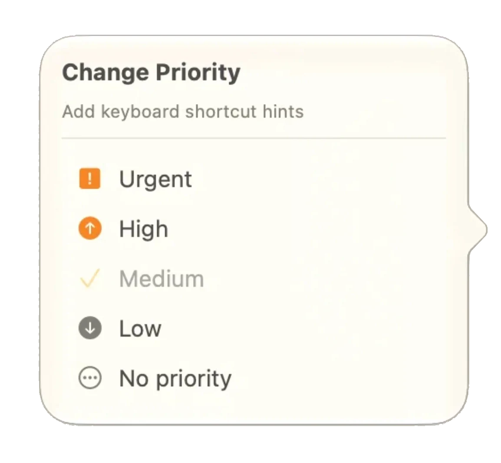
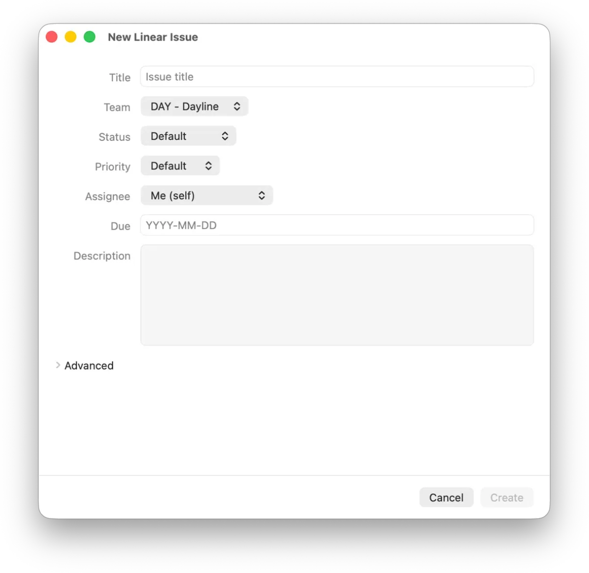
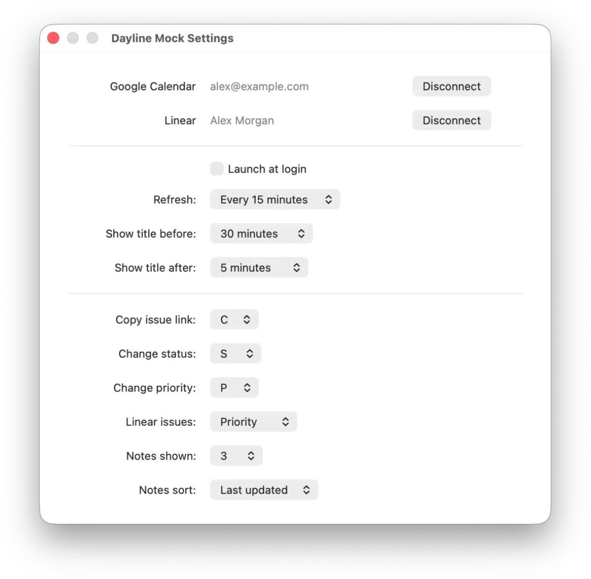

<p align="center">
  
</p>

<h1 align="center">Dayline</h1>

<p align="center">
  Your calendar, Linear or GitHub issues, and local notes in one quiet macOS menu.
</p>

<p align="center">
  <a href="https://dayline.robin.build"><strong>Website</strong></a>
  ·
  <a href="https://github.com/robin-liquidium/dayline/releases/latest/download/Dayline.dmg"><strong>Download the latest DMG</strong></a>
  ·
  <a href="https://github.com/robin-liquidium/dayline/releases/latest">Release notes</a>
</p>

<p align="center">
  
</p>

Dayline is a small, native SwiftUI menu bar app built for the information you
check throughout the day. It keeps upcoming Google Calendar events, active
Linear or GitHub issues, and quick local notes together without adding another dashboard
or Dock icon.

## Highlights

- **Calendar at a glance:** see remaining timed events today and optionally expand tomorrow.
- **Issues without the tab:** review assigned Linear or GitHub issues and update their status, labels, or assignee.
- **Local notes:** capture quick notes on this Mac; the first line becomes the title.
- **Keyboard-first actions:** hover an issue and use configurable shortcuts for copy, status, labels, assignee, and Linear-specific fields.
- **Super lightweight:** native and menu-bar-only, using next to no system resources in the background.
- **Quiet by design:** menu-bar-only, background refresh, launch at login, and configurable ordering.
- **Direct and private:** Dayline has no backend, account system, analytics, or tracking.

## Product Tour

### Know what is next

Dayline shows the rest of today without making you open Calendar. Expand
tomorrow when you want a head start.

<p align="center">
  
</p>

### Keep Linear close

Assigned issues stay within reach. Hover a row and press `C` to copy its URL,
`S` to change status, `L` to change labels, or `A` to change the assignee.
Linear issues also support `P` for priority and `D` for due date. The shortcuts are configurable.

<p align="center">
  
</p>

### Write it down locally

Notes are plain text and stay on this Mac. The first line becomes the menu title,
and more notes remain one click away.

<p align="center">
  
</p>

<details>
<summary><strong>More screenshots</strong></summary>

<br>

<table>
  <tr>
    <td width="50%" align="center">
      
      <br><strong>Quick status changes</strong>
    </td>
    <td width="50%" align="center">
      
      <br><strong>Quick priority changes</strong>
    </td>
  </tr>
  <tr>
    <td width="50%" align="center">
      
      <br><strong>Create Linear issues</strong>
    </td>
    <td width="50%" align="center">
      
      <br><strong>Focused, native settings</strong>
    </td>
  </tr>
</table>

</details>

## Requirements

- macOS 26 or newer

For source builds, install SwiftPM / Swift 5.9 or newer.

## Install

Download the notarized DMG from the
[latest GitHub release](https://github.com/robin-liquidium/dayline/releases/latest/download/Dayline.dmg),
open it, and drag Dayline into Applications.

Install the latest notarized release with Homebrew:

```bash
brew install --cask robin-liquidium/tap/dayline
```

To create and install a local development build instead:

```sh
./script/package_release.sh --install
```

## Connect Accounts

On first launch, connect either or both integrations from the menu:

- **Google Calendar:** link any number of Google accounts, then choose the readable
  calendars Dayline should merge into one agenda. Calendars currently visible in
  Google Calendar are enabled by default.
- **Linear:** read/write access for assigned issues and issue actions, filtered by user-selected teams.
- **GitHub:** assigned issues from user-selected repositories, with status, label, and assignee actions.

Google and Linear use OAuth 2.0 with PKCE; GitHub uses OAuth's device flow.
GitHub's OAuth `repo` scope grants Dayline access to every repository the
signed-in user can access; the selected repositories only filter what Dayline
displays and acts on.
Tokens are stored in the macOS
Keychain, and disconnecting a Google account revokes and removes only that
account's token. Shared meeting occurrences are shown once, with their source
calendar names visible in the agenda.

Official builds include the public OAuth client IDs needed for sign-in. Custom
builds can override them with `DAYLINE_GOOGLE_CLIENT_ID` and
`DAYLINE_LINEAR_CLIENT_ID`, or `DAYLINE_GITHUB_CLIENT_ID`.

<details>
<summary><strong>Configure different OAuth applications</strong></summary>

### Google

1. Create a Google Cloud project and enable the Google Calendar API.
2. Configure and publish the external OAuth consent screen.
3. Create an OAuth client of type **iOS** with bundle ID `build.local.Dayline`.
4. Put the client ID in `Sources/Dayline/Auth/AuthConfig.swift` or provide `DAYLINE_GOOGLE_CLIENT_ID` at launch.

Google's iOS client redirects through the reversed client ID scheme, which
Dayline derives automatically.

### Linear

1. Create an OAuth application in Linear under Settings → API → OAuth Applications.
2. Enable refresh tokens and add `dayline://oauth/callback` as a callback URL.
3. Mark the application public if it should work across other workspaces.
4. Put the client ID in `Sources/Dayline/Auth/AuthConfig.swift` or provide `DAYLINE_LINEAR_CLIENT_ID` at launch.

Dayline requests the `read,write` scopes.

### GitHub

1. Create a GitHub OAuth app and enable Device Flow.
2. Put the client ID in `Sources/Dayline/Auth/AuthConfig.swift` or provide `DAYLINE_GITHUB_CLIENT_ID` at launch.

Dayline requests `repo read:user` so it can read and update assigned issues in
public and private repositories. GitHub's classic OAuth scopes do not offer a
read-only private-repository permission.

</details>

## Privacy

Dayline talks directly from your Mac to Google Calendar, Linear, and GitHub over HTTPS.
There is no Dayline server between them.

- OAuth tokens live in the macOS Keychain.
- Linked account labels, calendar selections, and GitHub repository selections live in local app preferences.
- Notes live in `~/Library/Application Support/Dayline/notes.json`.
- Calendar, Linear, and GitHub data is held in memory for display.
- Dayline does not include analytics, tracking, advertising, or an account system.

## Build from Source

Clone the repository, then build and launch the local app bundle:

```sh
git clone https://github.com/robin-liquidium/dayline.git
cd dayline
./script/build_and_run.sh
```

Useful development modes:

```sh
./script/build_and_run.sh --verify
./script/build_and_run.sh --debug
./script/build_and_run.sh --logs
./script/build_and_run.sh --telemetry
```

The script builds with SwiftPM, creates `dist/Dayline.app`, and launches it as a
menu bar accessory app.

## Screenshot Mode

Dayline includes an isolated mock app for screenshots, demos, and visual testing:

```sh
./script/build_mock_and_run.sh
DAYLINE_APP_NAME="Dayline Mock" ./script/menu_test.sh open
```

`Dayline Mock.app` has its own bundle ID and connected-looking sample Calendar,
Linear, and Notes data. Refreshes, account actions, issue updates, and note edits
remain in memory and never use real OAuth tokens, APIs, or the production notes
file.

## Development Helpers

The Accessibility-driven menu helper can inspect and operate either the real or
mock app:

```sh
./script/menu_test.sh open
./script/menu_test.sh screenshot /tmp/dayline.png
./script/menu_test.sh tree
./script/menu_test.sh identifiers
./script/menu_test.sh press-id calendar.tomorrow.toggle
./script/menu_test.sh press-id linear.new
./script/menu_test.sh press-id linear.showMore
./script/menu_test.sh press-id notes.new
./script/menu_test.sh scroll down
```

Run the complete smoke test with:

```sh
./script/smoke_test.sh
```

<details>
<summary><strong>Stable accessibility identifiers</strong></summary>

- `dayline.refresh`
- `dayline.settings`
- `dayline.quit`
- `setup.checkAgain`
- `setup.google`
- `setup.google.connect`
- `setup.google.<ACCOUNT-UUID>`
- `setup.google.<ACCOUNT-UUID>.reconnect`
- `setup.linear`
- `setup.linear.connect`
- `calendar.tomorrow.toggle`
- `linear.new`
- `linear.showMore`
- `linear.showLess`
- `linear.issue.<ISSUE-ID>`
- `linear.cancel.<ISSUE-ID>`
- `linearEditor.title`
- `linearEditor.description`
- `linearEditor.create`
- `linearEditor.cancel`
- `notes.new`
- `notes.showMore`
- `notes.showLess`
- `notes.note.<NOTE-ID>`
- `notes.delete.<NOTE-ID>`
- `noteEditor.text`
- `noteEditor.save`
- `noteEditor.cancel`
- `settings.account.google`
- `settings.account.google.add`
- `settings.account.google.<ACCOUNT-UUID>`
- `settings.account.google.<ACCOUNT-UUID>.reconnect`
- `settings.account.google.<ACCOUNT-UUID>.disconnect`
- `settings.account.google.<ACCOUNT-UUID>.calendar.<CALENDAR-ID>`
- `settings.account.linear`
- `settings.launchAtLogin`
- `settings.refreshCadence`
- `settings.menuBarEventLeadTime`
- `settings.menuBarEventPostStartGrace`
- `settings.copyIssueHotkey`
- `settings.statusPickerHotkey`
- `settings.priorityPickerHotkey`
- `settings.linearIssueOrder`
- `settings.defaultNoteCount`
- `settings.localNoteSortOrder`

</details>

## Project Layout

```text
Sources/Dayline/App/        App entry point
Sources/Dayline/Auth/       OAuth sessions, PKCE, and Keychain token storage
Sources/Dayline/Models/     Display and persistence models
Sources/Dayline/Services/   Google Calendar, Linear, and local notes services
Sources/Dayline/Stores/     App state and refresh loop
Sources/Dayline/Support/    Formatters, mock data, and window helpers
Sources/Dayline/Views/      SwiftUI views
script/                     Build, release, smoke, and menu test helpers
website/                    TanStack Start landing page for Cloudflare Workers
```

## Release Process

Public releases are built, signed, notarized, stapled, and published by GitHub
Actions when a `vX.Y.Z` tag is pushed.

<details>
<summary><strong>Maintainer release instructions</strong></summary>

### One-time setup

Export the Developer ID Application certificate and private key as a
password-protected `.p12`, create an App Store Connect API key for notarization,
then run:

```sh
./script/configure_release_secrets.sh
```

Required GitHub Actions secrets:

- `MACOS_CERTIFICATE_P12_BASE64`
- `MACOS_CERTIFICATE_PASSWORD`
- `APP_STORE_CONNECT_KEY_P8_BASE64`
- `APP_STORE_CONNECT_KEY_ID`
- `APP_STORE_CONNECT_ISSUER_ID`
- `DAYLINE_SPARKLE_PRIVATE_KEY`

### Automatic updates

Dayline uses Sparkle 2. The production feed is the signed
[`website/public/appcast.xml`](website/public/appcast.xml) served at
`https://dayline.robin.build/appcast.xml`; release archives remain immutable,
versioned GitHub Release assets. Never hand-edit the feed after it has been
signed.

The EdDSA private key is stored in the maintainer's macOS Keychain under the
Sparkle account `dayline` and in the encrypted GitHub Actions secret
`DAYLINE_SPARKLE_PRIVATE_KEY`. GitHub secrets cannot be exported again, so keep
a separate secure backup of the key. The public key compiled into Dayline is
not secret.

Only an exact stable `vX.Y.Z` release may enter the production feed. Signed but
unnotarized test builds must remain prereleases and must never be marked latest.
After both the app and DMG pass notarization and validation, the continuation
workflow signs and uploads the appcast, publishes the stable release, then
commits only the updated appcast to `main` so Cloudflare deploys it. The
scheduled continuation reconciles that final feed commit if publication fails
transiently.

The first Sparkle-enabled release is a manual-download bootstrap because older
Dayline versions contain no updater. Later production releases update
automatically. Maintainers can exercise the same signed download, replacement,
and relaunch path before release with isolated lower/higher local builds and a
localhost appcast.

### Publish a version

After release changes are merged to a clean, synchronized `main` branch:

```sh
./script/tag_release.sh 0.1.4
```

The script validates the branch, clean tree, remote synchronization, and version
uniqueness before pushing the tag. The release workflows then:

1. Builds and tests the exact tagged commit.
2. Imports the Developer ID certificate.
3. Signs with hardened runtime and timestamping.
4. Uploads the exact signed app to a private draft release before submitting it
   to Apple once.
5. Exits instead of holding a GitHub-hosted runner open while Apple processes it.
6. Checks pending drafts every ten minutes, resuming the saved submission ID.
7. Staples the accepted app, builds and submits the DMG once, and saves that ID.
8. Staples and validates the accepted DMG and app, runs Gatekeeper checks, then
   publishes the versioned DMG, app ZIP, stable `Dayline.dmg`, and signed
   `appcast.xml` assets, then deploys the appcast through the website.

The scheduled continuation is idempotent and verifies preserved artifact hashes
before contacting Apple. To check one pending release immediately:

```sh
gh workflow run notarization-continuation.yml -f tag=v0.1.4
```

Do not rerun the submission workflow while its private draft is pending. The
continuation resumes the stored artifact and submission rather than uploading a
new copy merely because Apple is slow.

CI also runs `swift build` and `swift test` for pull requests and pushes to
`main`. Regular pushes never publish releases.

### Manual fallback

Create local unsigned or development-signed artifacts:

```sh
./script/package_release.sh
```

Official notarization should run through GitHub Actions so the preserved artifact,
submission IDs, and continuation state stay together. The scripts reject dirty,
untagged, mismatched, corrupt, or duplicate public releases.

</details>
